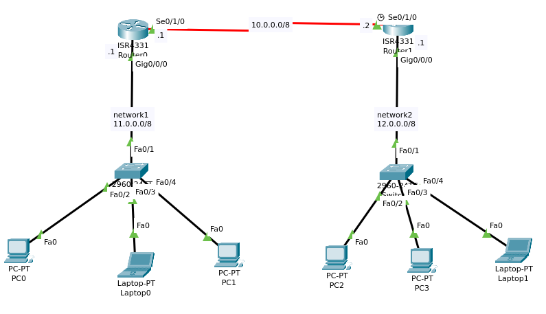
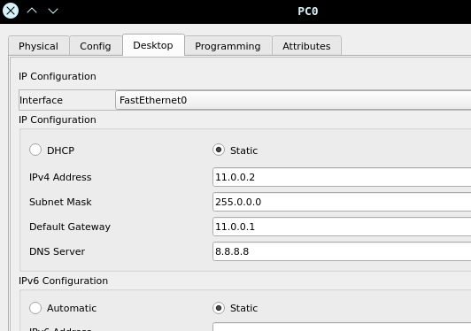
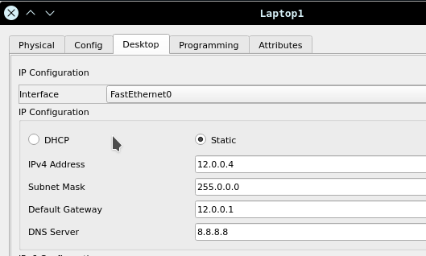
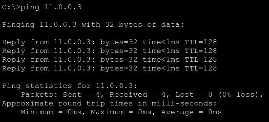

# <!-- diagram pic -->
# **Network Diagram** 



# <!-- the task i'm given -->
# **Task**
the task is to assign IP address to the hosts manually. 

**requirements:** 
- `router 0` and `router 1` share `10.0.0.0/8` ip address at both their `se0/1/0` interface 
- at `gig0/0/0` interface of `router 0`, the network ishaving `11.0.0.1/8` ip address
- and at `gig0/0/0` interface of `router 1`, the network is having `12.0.0.1/8` ip address


# <!-- steps to follow -->
# **Steps**
for both routers, 
1. go to the router's `configuration mode`
2. select and enable the `interface` to start functioning
3. provide `ip` and `subnet mask`
4. `save` and `exit` outta router
5. statically (manually) assign ip to each end devices
6. test connections


#  <!-- commands for packettracer cli -->
# **Commands**:

## **STEP 1. GO TO THE CONFIGURATION MODE**:
- to go to the `configuration mode`, 
    - (i) first go to the `user EXEC(ution) mode` 
    - (ii) then to the `privileged EXEC(ution) mode` 
    - (iii) and then finally to the `configuration mode`

>
- (i) go to the **user EXEC(ution) mode**:

        --- System Configuration Dialog ---

        Would you like to enter the initial configuration dialog? [yes/no]:
    unless you wanna enter the initial configuration dialog, type `no`; and then if you see router interface like this, then you're in the **user EXEC mode**:

        Router>	
    


- (ii) go to the **privileged EXEC mode**:

    type `enable` or `en` to go to the p**privileged EXEC mode**. if you're in, you should see `#` after your router's name like this:
        
        Router> enable
        Router#	


- (iii) go to the **the configuration mode**:

    type `configure terminal` or `conf t` to go to **the configuration mode**. once you're in, you should see `(config)#` after your router's name like this:
        
        Router# configure terminal
        Router(config)# 	


## **STEP 2. SELECT AND TURN THE INTERFACE ON**:
- (i) **interface** selection:
    
    to select an interface, type your `interface_name` followed by `int` or `interface` keyword. for example, here i'mma choose my router interface `serial 0/1/0` (i.e. `se0/1/0`). once an interface is selected, it should contain **config-if** and look like this:
        
        Router(config)# interface se0/1/0
        Router(config-if)#

- (ii) **enable the interface** to start functioning:

    by default, interfaces on network devices are in a shutdown state to ensure that they don't pass any traffic until explicitly enabled, so to enable the interface, type `no shutdown`

        Router(config-if)# no shutdown
        
    and you should see '**changed state to up**'. like this:

        %LINEPROTO-5-UPDOWN: Line protocol on Interface Serial0/1/0, changed state to up


## **3. provide ip address and subnet mask**:

- **providing ip address and subnetmask** to the interfaces:

    [for each of the interface, select the interface name first]

    here, **Router0** and **Router1** share **10.0.0.0/8** ip address at both their **se0/1/0** interface. i'mma give **10.0.0.1** to the **Router0**'s and **10.0.0.2** to the **Router1**'s interface **se0/1/0**

    and as for the subnet mask, it's **255.0.0.0** ('cause it's a /8 net)

        Router(config-if)# ip address 10.0.0.1 255.0.0.0

    then exit outta interface, choose another interface, and do the same thing for all other router's all interfaces.
    
- ## for this network diagram above, do this:

    ### -------------------\
    ### |**for, Router 0:**
    ### -------------------/

        Router0(config)# interface se0/1/0
        Router0(config-if)# no shutdown
        Router0(config-if)# ip address 10.0.0.1 255.0.0.0
        Router0(config-if)# exit

        Router0(config)# interface gig0/0/0
        Router0(config-if)# no shutdown
        Router0(config-if)# ip address 11.0.0.1 255.0.0.0
        Router0(config-if)# exit
        Router0(config)# exit
        Router0# 


    ### -------------------\
    ### |**for, Router 1:**
    ### -------------------/


        Router1(config)# interface se0/1/0
        Router1(config-if)# no shutdown
        Router1(config-if)# ip address 10.0.0.1 255.0.0.0
        Router1(config-if)# exit

        Router1(config)# interface gig0/0/0
        Router1(config-if)# no shutdown
        Router1(config-if)# ip address 12.0.0.1 255.0.0.0
        Router1(config-if)# exit
        Router1(config)# exit
        Router# 


## **STEP 4. SAVE AND EXIT OUTTA ROUTER**:

-  to **save** the configuration, 
        
        RouterX# copy running-config startup-config 
    
    or just simply,

        RouterX# wr 
    
    do it before exiting both of the routers.

- to **exit**,

    close your window by `Alt+F4 ` or type `exit` again
        
        RouterX# exit
        RouterX>
    
    

## **STEP 5. STATICALLY ASSIGN IP TO EACH END DEVICES**:
- to assign address to the end-devices,

    `select the device` > `desktop` > `IP Configuration` > `choose static`
    
    and then provide `IPv4`, `Subnet Mask`, `Default Gateway`, and `DNS Server`'s address

- ### here, i'mma assign address to PC0 Network_1:
        
    i can assign any IP in this range:

    `11.0.0.2` to `11.255.255.254` 

    `first` one (`11.0.0.0`) is the `network` IP

    `last` one (`11.255.255.255`) is the `broadcast` IP

    and `11.0.0.2` is our **gateway** IP


    ```
    IPv4 Address: 11.0.0.2
    Subnet Mask: 255.0.0.0
    Default Gateway: 11.0.0.1
    DNS Server: 8.8.8.8
    ```
    
    like this:

    


    *[do for the rest of the devices]*


- ### similarly assign address to a device from Network_2:


    

    and then it's over, Obi Wan Kenobi, you have the higher ground! 


## **STEP 6. TEST CONNECTIONS**:
- finally, to test if it's working, ping to devices in your (same) network
    
    `select the source device` > `desktop` > `command prompt`

    then `ping` your targer - could be the router (gateway) or other devices in the same net.

    here, i'm pining `PC-1` from `PC-0`:
    
    

    it sends 4 packets, and for the 1st ping, 1st packet will be lost - for remaining 3 packets, you'll get acknowledgements iff you did everything correctly.


**[go through the .pkt file and run]**
