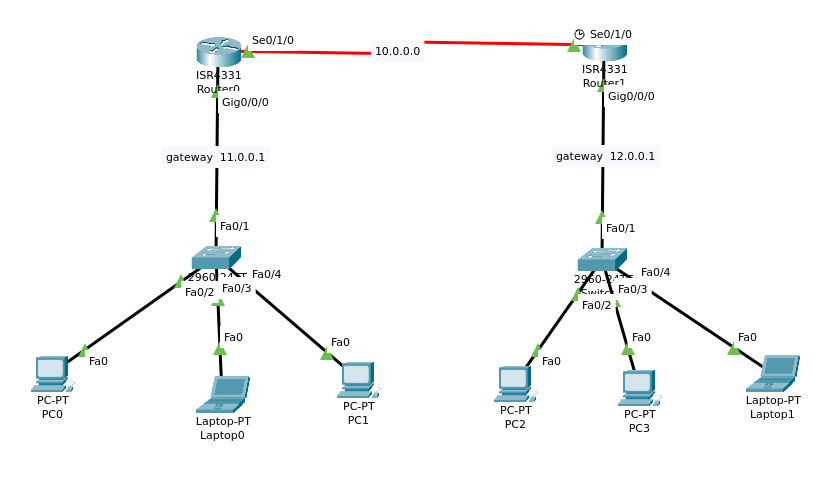

# <!-- diagram pic -->
# **Network Diagram** 

# <!-- the task i'm given -->
# **Task**
the task is to assign IP address to the hosts manually. 

**requirements:** 
- `router 0` and `router 1` share `10.0.0.0/8` ip address atboth their `se0/1/0` interface 
- at `gig0/0/0` interface of `router 0`, the network ishaving `11.0.0.1/8` ip address
- and at `gig0/0/0` interface of `router 1`, the network is having `12.0.0.1/8` ip address

# <!-- steps to follow -->
# **Steps**
for both routers, 
1. go to the router's `configuration mode`
2. select and enable the `interface` to start functioning
3. provide `ip` and `subnet mask`
4. exit outta router
5. statically (manually) assign ip to each end devices

#  <!-- commands for packettracer cli -->
# **Commands**:

## **STEP 1. go to the configuration mode**:
- to go to the `configuration mode`, 
    - (i) first go to the `user EXEC(ution) mode` 
    - (ii) then to the `privileged EXEC(ution) mode` 
    - (iii) and then finally to the `configuration mode`

>
- (i) go to the **user EXEC(ution) mode**:

        --- System Configuration Dialog ---

        Would you like to enter the initial configuration dialog? [yes/no]:
    unless you wanna enter the initial configuration dialog, type `no`; and then if you see router interface like this, then you're in the **user EXEC mode**:

        Router>	
    

- (ii) go to the **privileged EXEC mode**:

    type `enable` or `en` to go to the p**privileged EXEC mode**. if you're in, you should see `#` after your router's name like this:
        
        Router> enable
        Router#	

- (iii) go to the **the configuration mode**:

    type `configure terminal` or `conf t` to go to **the configuration mode**. once you're in, you should see `(config)#` after your router's name like this:
        
        Router# configure terminal
        Router(config)# 	

## **STEP 2. select and turn the `interface` on**:
- (i) **interface** selection:
    
    to select an interface, type your `interface_name` followed by `int` or `interface` keyword. for example, here i'mma chose my router interface `serial 0/1/0` (i.e. `se0/1/0`). once an interface is selected, it should contain **config-if** look like this:
        
        Router(config)# interface se0/1/0
        Router(config-if)#

- (ii) **enable the interface** to start functioning:

    by default, interfaces on network devices are in a shutdown state to ensure that they don't pass any traffic until explicitly enabled, so to enable the interface, type `no shutdown`

`
Router>	- user EXEC mode
Router#	- privileged EXEC mode
Router(config)#	- Configuration mode (notice the # sign indicates this is accessible only at privileged EXEC mode)
Router(config-if)#	- Interface level within configuration mode
Router(config-router)#	- Routing engine level within configuration mode
Router(config-line)#	- Line level (vty, tty, async) within configuration mode
`
